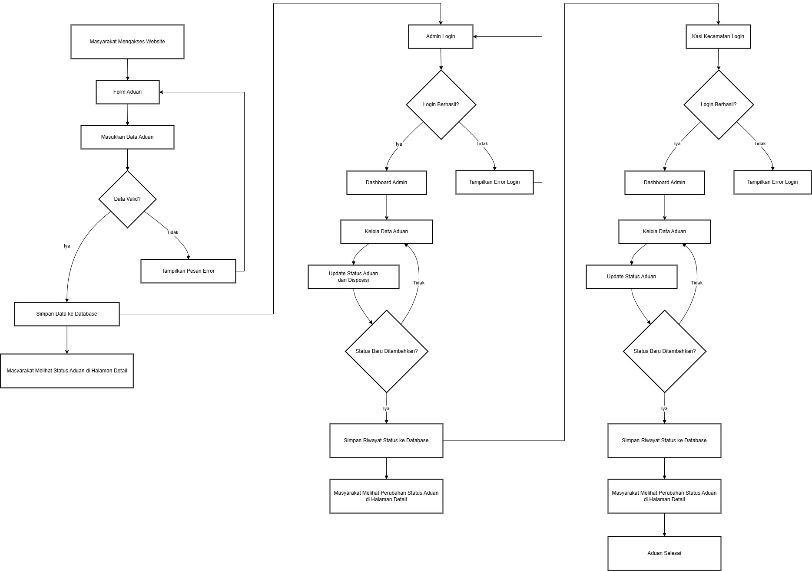
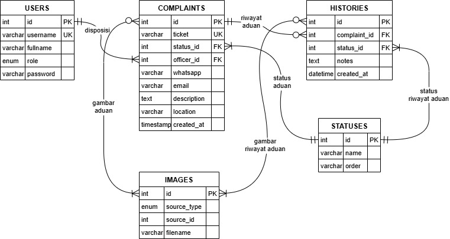

# Si Moni

## Deskripsi

Si Moni (Sistem Monitoring Aduan Gajahmungkur) adalah sebuah platform berbasis web untuk mempermudah masyarakat dalam menyampaikan aduan di wilayah Kecamatan Gajahmungkur. Dengan teknologi berbasis PHP, MySQL, dan Bootstrap, Si Moni memungkinkan masyarakat mengisi form pengaduan, melampirkan bukti gambar, dan memantau status aduan secara real-time.

Admin dapat mengelola setiap aduan melalui dashboard yang dilengkapi fitur seperti pembaruan status, pencatatan respon, dan unggahan dokumentasi tambahan. Sistem ini bertujuan untuk meningkatkan transparansi, efisiensi, dan akuntabilitas dalam penyelesaian aduan warga.

## Fitur

- **Form Pengaduan**: Fitur ini memungkinkan pengguna untuk mengisi form pengaduan dengan memasukkan informasi yang diperlukan seperti nama, nomor whatsapp, alamat email, deskripsi aduan, dan lampiran gambar.
- **Dashboard**: Fitur ini memungkinkan admin untuk mengelola setiap aduan yang masuk, memperbarui status, mencatat respon, dan mengunggah dokumentasi tambahan.
- **Pencarian Aduan**: Fitur ini memungkinkan pengguna untuk mencari aduan berdasarkan kode tiket yang diberikan.
- **Lacak Aduan**: Fitur ini memungkinkan pengguna untuk melacak status aduan secara real-time.

## Teknologi yang Digunakan

- **PHP**: Bahasa pemrograman server-side yang digunakan untuk mengembangkan fitur-fitur dinamis pada website ini.
  - **Referensi**: https://www.w3schools.com/php/
- **HTML**: Bahasa markup yang digunakan untuk membuat struktur dan konten dari halaman web.
  - **Referensi**: https://www.w3schools.com/html/
- **CSS**: Digunakan untuk mendesain dan mengatur tampilan dari halaman web agar lebih menarik dan responsif.
  - **Referensi**: https://www.w3schools.com/css/
- **MySQL**: Sistem manajemen basis data yang digunakan untuk menyimpan dan mengelola data secara efisien.
  - **Referensi**: https://www.w3schools.com/MySQL/
- **Bootstrap**: Framework CSS yang digunakan untuk mempercepat pengembangan antarmuka pengguna yang responsif dan modern.
  - **Referensi**: https://getbootstrap.com/docs/5.3/getting-started/introduction/

## Struktur File

Struktur file website Si Moni terdiri dari beberapa file, yaitu:

- `config.php`: file konfigurasi yang berisi informasi tentang database dan pengaturan aplikasi
- `login.php`: berfungsi sebagai halaman login yang memungkinkan pengguna untuk melakukan otentikasi dan mengakses halaman dashboard admin
- `index.php`: berfungsi sebagai halaman utama dari aplikasi, yang menampilkan berbagai fitur seperti form pengaduan, lacak aduan, dan informasi umum lainnya.
- `dashboard.php`: berfungsi sebagai halaman admin, yang menampilkan informasi rekap semua aduan
- `detail.php`: berfungsi untuk menampilkan informasi detail dari aduan dan memungkinkan admin untuk mengelola setiap aduan dengan fitur pembaruan status, pencatatan respon, dan unggahan dokumentasi tambahan

## Flowchart

Berikut adalah flowchart dari website Si Moni:

## Data Flow Diagram (DFD)

Berikut adalah DFD dari website Si Moni:

## Entity Relationship Diagram (ERD)

Berikut adalah ERD dari database Si Moni:

## Instalasi

1. Kloning repository dengan cara klik tombol Code (warna hijau) di atas dan pilih "Download ZIP" atau menggunakan perintah `git clone` di terminal
2. Ekstrak file ZIP yang Anda download
3. Buat database MySQL dengan nama `simoni_db` dan import file `database.sql`
4. Konfigurasi file `config.php` dengan informasi database Anda

## Penggunaan

1. Jalankan aplikasi dengan perintah `php -S localhost:8000` di terminal atau gunakan XAMPP/WAMP/LAMP/Laragon untuk menjalankan aplikasi
2. Akses website di browser web Anda di `http://localhost:8000` atau `http://localhost/simoni` jika Anda menggunakan XAMPP/WAMP/LAMP/Laragon
3. Masuk dengan kredensial Anda atau buat akun baru:
   - Admin : `admin` / `admin`
4. Explore fitur-fitur website dan mulai mengelola data aduan Anda

## Screenshot

Berikut adalah beberapa screenshot dari website Si Moni:

### Desktop

- Halaman Login

  

- Halaman Form Aduan

  

- Halaman Detail Aduan

  

- Halaman Detail Aduan (Admin)

  

- Halaman Dashboard (Admin)

  

### Mobile

- Halaman Login

  

- Halaman Form Aduan

  

- Halaman Detail Aduan

  

  
- Halaman Dashboard (Admin)

  

## License

This project is licensed under the [MIT License](LICENSE).
